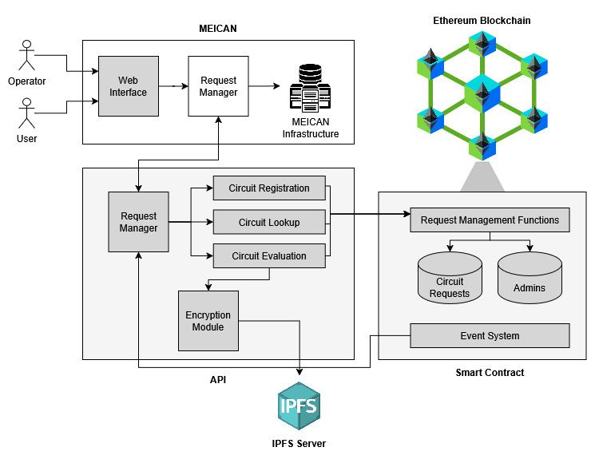
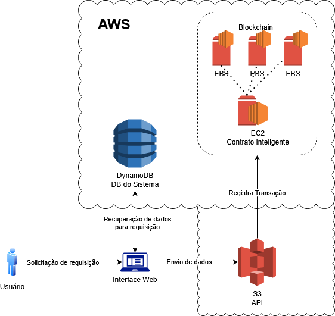

## Desafio Prático - Elaboração de Arquitetura Cloud AWS no Drawio
Para este desafio, utilizei como base a arquitetura da minha solução desenvolvida em meu TCC, mas de forma simplificada.

**Contexto:** a solução proposta foi uma API que integrasse um sistema de gerenciamento de solicitações de circuitos interdomînios à uma blockchain, com o intuíto de utilizar a blockchain para realização de auditoria. O objetivo do trabalho é aumentar a confiabilidade e transparência entre os domínios do circuito.

# Resolução do desafio

## Descrição
O usuário realiza uma solicitação de circuito via interface web, que solicita uma consulta à um banco de dados para recuperação de informações para dar seguimento a solicitação. Ao retornar as informações para o gerenciador de requisições, este realiza uma chamada para a API (que utiliza S3) para transferência de arquivos e dados da solicitação. Esta API realiza a comunicação com um Contrato Inteligente (rodando nos nodos EC2 com EBS) na blockchain, que recebe as informações e registra a transação na blockchain.
